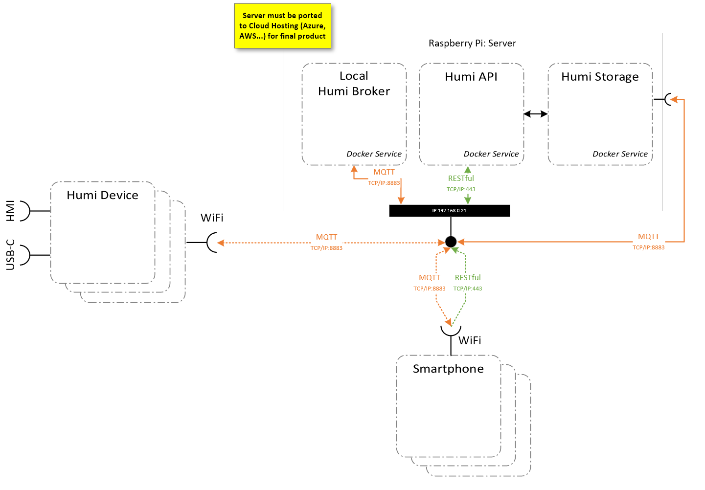

# Server Infrastrukture
The following illustration shows an overview about ARQMS and all parts


# First Step
Ensure docker and docker compose is installed on your developing machine.
```
repo> docker compose -p "ARQMS" up -d
```

# Installation
The following steps are only required for productive system. See [First Step](#first-step) otherwise

[Raspberry PI](./docs/installation-rpi.md)
Azure Cloud (TBD)
